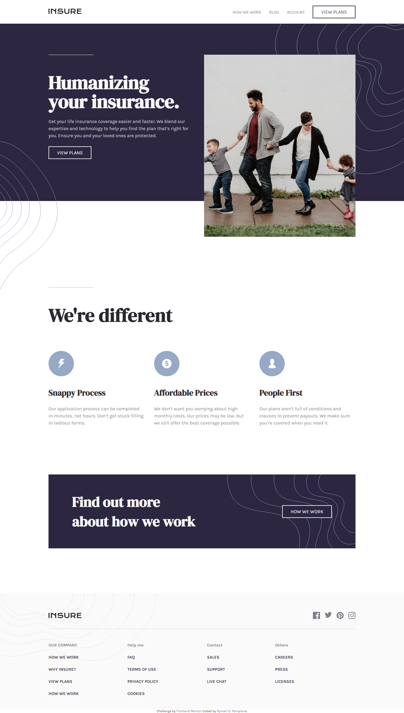

# Frontend Mentor - Insure landing page solution

This is a solution to the [Insure landing page challenge on Frontend Mentor](https://www.frontendmentor.io/challenges/insure-landing-page-uTU68JV8). Frontend Mentor challenges help you improve your coding skills by building realistic projects. 

## Table of contents

- [Overview](#overview)
  - [The challenge](#the-challenge)
  - [Screenshot](#screenshot)
  - [Links](#links)
- [My process](#my-process)
  - [Built with](#built-with)
  - [What I learned](#what-i-learned)
  - [Continued development](#continued-development)
  - [Useful resources](#useful-resources)
- [Author](#author)
- [Acknowledgments](#acknowledgments)

### The challenge

Users should be able to:

- View the optimal layout for the site depending on their device's screen size
- See hover states for all interactive elements on the page

### Screenshot

I did not include the mobile screenshots since it is very long ahahaa

### Links

Live Site URL: [Live site of the challenge hosted here](https://pikapikamart.github.io/frontendmentor-insure/)

## My process

Hello, this is my 17th frontendmentor challenge. This was made using SCSS only for the bonus. Now this challenge made me used more of thinking, identifying and creating extensible classes in css. I was happy for it, but there are still a lot of improvement for reaching the truly extensible and reusable components. Thank you for visiting this, have a good day^^

### Built with

- Semantic HTML5 markup
- CSS custom properties
- FlexBox
- Sass preprocessor

I said that I won't use any frameworks and build it from scratch to be more exciting and challenging

### What I learned

i learned in this challenge to create more extensible components in scss. The creation part is easy, but identifying what sections can be made, and be reused are the challenged. 

### Continued development

I want to focus more on creating more complex designs and also designing things on my own time

## Author

- Website - Well I haven't made my profile portfolio, gonna make it sooon when I know a lot of stuffs
- Frontend Mentor - [@pikamart](https://www.frontendmentor.io/profile/pikamart)
- Twitter - [@RaymartPamplona](https://twitter.com/RaymartPamplona)